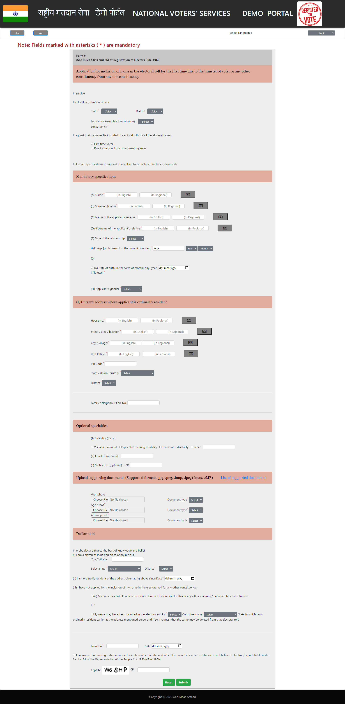

# Voter's Registration Portal 🗳️

Voting is a great power in the hands of citizens. Voting is an opportunity for change. But to contribute to that change you need to register yourself as an eligible voter.
<p align="center"></p>

But where and how to register? 
<p align="center"></p>

Don't worry, now you don't need to circle around government office. All you need is a proper internet connection and a device, because you can do it online at voter registration portal 🙌
<p align="center"></p>

## A sneak peek into what we have here🙈 :

<p align="center"></p>

## About

This is a demo website of National Voters' Registration portal. All Indian citizens who are eligible to vote can register themselves on this website to get their voter ID's. This portal allow users to fill (Form 6 of Electors Rule-1960) an application for inclusion of name in electoral roll.

## Link to the website
https://qazimaazarshad.github.io/Voters-Registration-Portal/

## Tech Stack


## How to get started❓

You can refer to the following articles on the basics of Git and Github and also contact the Project Mentors, in case you are stuck:

- If you don't have git on your machine, [install](https://help.github.com/articles/set-up-git/) it.
- [Watch this video to get started, if you have no clue about open source](https://youtu.be/SL5KKdmvJ1U)
- [Forking a Repo](https://help.github.com/en/github/getting-started-with-github/fork-a-repo)
- [Cloning a Repo](https://docs.github.com/en/github/creating-cloning-and-archiving-repositories/cloning-a-repository-from-github/cloning-a-repository)
- [How to create an Issue](https://docs.github.com/en/issues/tracking-your-work-with-issues/creating-issues/creating-an-issue)
- [How to create a Pull Request](https://opensource.com/article/19/7/create-pull-request-github)
- [Getting started with Git and GitHub](https://towardsdatascience.com/getting-started-with-git-and-github-6fcd0f2d4ac6)

## Contribution Guidelines 🏗

Are we missing any of your favorite features, which you think you can add to it❓ We invite you to contribute to this project and improve it further.

To start contributing, follow the below guidelines: 

**🌟.** Star🌟 the repo to appreciate the work.

**0.**  Take a look at the existing [issues](https://github.com/QAZIMAAZARSHAD/Voters-Registration-Portal/issues) or create your own issues. Wait for the Issue to be assigned to you after which you can start working on it.

**1.**  Fork [this](https://github.com/QAZIMAAZARSHAD/Voters-Registration-Portal) repository.

**2.**  Clone your forked copy of the project.

```
git clone --depth 1 https://github.com/<your_user_name>/Voters-Registration-Portal.git
```

**3.** Navigate to the project directory :file_folder: .

```
cd Voters-Registration-Portal
```

**4.** Add a reference(remote) to the original repository.

```
git remote add upstream https://github.com/QAZIMAAZARSHAD/Voters-Registration-Portal.git 
```

**5.** Check the remotes for this repository.

```
git remote -v
```

**6.** Always take a pull from the upstream repository to your master branch to keep it at par with the main project(updated repository).

```
git pull upstream master
```

**7.** Create a new branch.

```
git checkout -b <your_branch_name>
```

**8.** Perform your desired changes to the code base.

<p align="center"></p>

**9.** Track your changes:heavy_check_mark: .

```
git add . 
```

**10.** Commit your changes .

```
git commit -m "Relevant message"
```

**11.** Push the committed changes in your feature branch to your remote repo.

```
git push -u origin <your_branch_name>
```

**12.** To create a pull request, click on `compare and pull requests`. Please ensure you compare your feature branch to the desired branch of the repo you are suppose to make a PR to.

**13.** Add appropriate title and description to your pull request explaining your changes and efforts done.

**14.** Click on `Create Pull Request`.

**15.** Voila :exclamation: You have made a PR to the National Voters' Registration website :boom:. Sit back patiently and relax while the project maintainers review your PR. Please understand, at times the time taken to review a PR can vary from a few hours to a few days.

<p align="center"></p>

## Project Admin👨‍:

<p align="center">

</p>

<a href="https://www.linkedin.com/in/qazi-maaz-arshad/">
<h5 align="center"><b>Qazi Maaz Arshad</b></a>

## Open Source Programs we have been associated with: 

<p align="center">
<a href="https://lgmsoc.co/">

<a href="https://devincept.codes/projects.html">

</p>

## Code of Conduct
<p align="center">
<a href="https://github.com/QAZIMAAZARSHAD/Voters-Registration-Portal/blob/master/CODE_OF_CONDUCT.md">
</p>
<h5 align="center"><b>Click to read</b></a>  

## License 
<p align="center">
<a href="https://github.com/QAZIMAAZARSHAD/Voters-Registration-Portal/blob/master/LICENSE">
</p>
<h5 align="center"><b>MIT License</b></a> 


## ✨ Contributors
<a href = "https://github.com/QAZIMAAZARSHAD/Voters-Registration-Portal/graphs/contributors">
  
</a>
